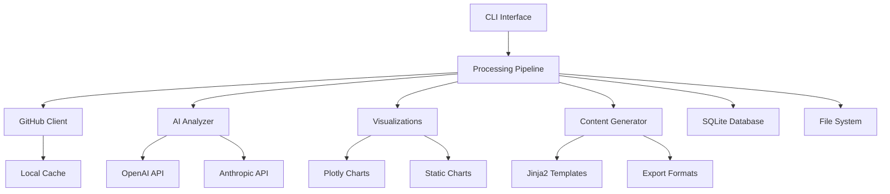
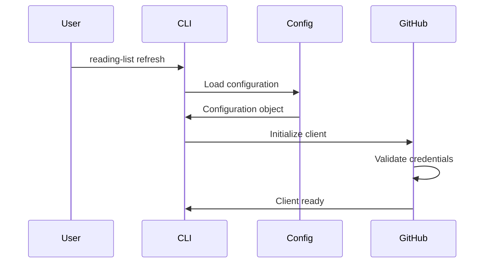
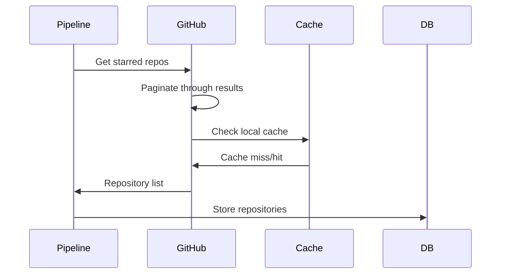
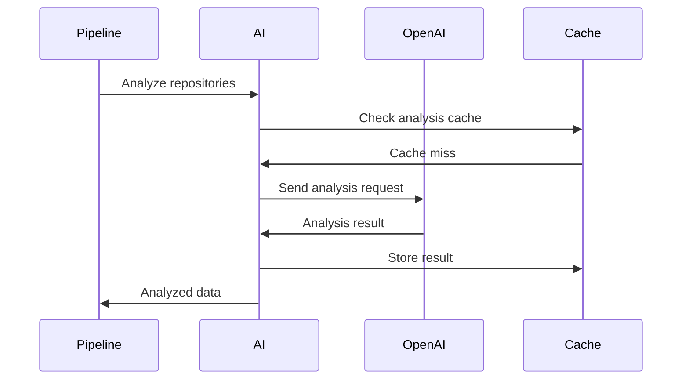
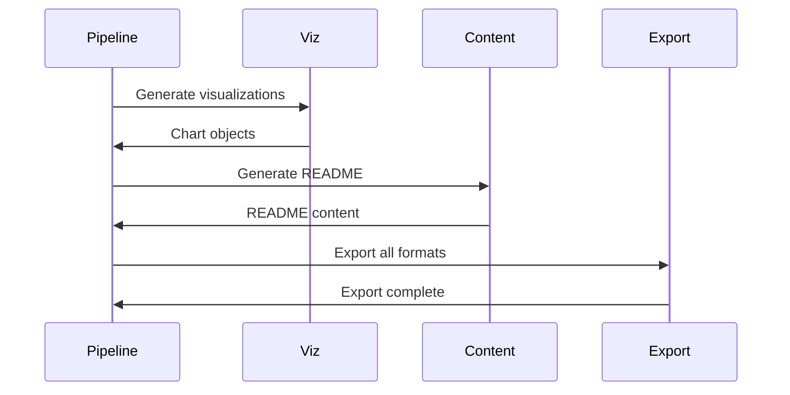

# 🏗️ Architecture Documentation

## Overview

The GitHub Reading List Generator is designed as a modular, scalable system that combines GitHub API integration, AI-powered analysis, and data visualization capabilities. The architecture follows clean code principles with clear separation of concerns and extensible design patterns.

## 🎯 Design Principles

- **Modularity**: Each component has a single responsibility
- **Extensibility**: Easy to add new AI providers, visualization types, and export formats
- **Performance**: Async operations, caching, and rate limiting
- **Reliability**: Comprehensive error handling and retry logic
- **Testability**: Clear interfaces and dependency injection
- **Configuration**: Flexible configuration management

## 📊 System Architecture



## 🔧 Core Components

### 1. CLI Interface (`cli.py`)

**Purpose**: Command-line interface for user interactions

**Key Features**:
- Click-based command structure
- Rich console output with progress bars
- Multiple commands: `refresh`, `export`, `serve`, `init`
- Configuration validation and setup

**Commands**:
```python
@click.group()
def cli():
    """GitHub Reading List Generator CLI"""

@cli.command()
def refresh():
    """Refresh the reading list data"""

@cli.command()
def export():
    """Export data in various formats"""

@cli.command() 
def serve():
    """Start the web dashboard"""

@cli.command()
def init():
    """Initialize configuration files"""
```

### 2. Processing Pipeline (`pipeline.py`)

**Purpose**: Orchestrates the entire data processing workflow

**Workflow**:
1. Load configuration and validate settings
2. Initialize GitHub client with authentication
3. Fetch starred repositories with pagination
4. Process repositories through AI analysis
5. Generate visualizations and content
6. Export results in multiple formats
7. Update local cache and database

**Key Methods**:
```python
class Pipeline:
    async def run(self) -> ProcessingResult
    async def fetch_repositories(self) -> List[Repository]
    async def analyze_repositories(self, repos: List[Repository]) -> AnalysisResult
    async def generate_visualizations(self, analysis: AnalysisResult) -> List[Visualization]
    async def generate_content(self, analysis: AnalysisResult) -> ContentResult
```

### 3. GitHub Client (`github_client.py`)

**Purpose**: Handles all GitHub API interactions with robust error handling

**Features**:
- **Authentication**: Personal access tokens and OAuth
- **Rate Limiting**: Intelligent rate limit handling with exponential backoff
- **Pagination**: Automatic handling of paginated responses
- **Caching**: Local caching to minimize API calls
- **Async Support**: Non-blocking operations for performance
- **Error Handling**: Comprehensive error handling and retry logic

**Implementation**:
```python
@dataclass
class Repository:
    id: int
    name: str
    full_name: str
    description: Optional[str]
    html_url: str
    stargazers_count: int
    language: Optional[str]
    topics: List[str]
    created_at: datetime
    updated_at: datetime
    pushed_at: datetime
    size: int
    default_branch: str
    archived: bool
    disabled: bool
    private: bool
    fork: bool
    license: Optional[dict]
    open_issues_count: int
    forks_count: int
    watchers_count: int
    network_count: int
    subscribers_count: int
    
class GitHubClient:
    async def get_starred_repositories(self, username: str) -> AsyncIterator[Repository]
    async def get_repository_content(self, repo: Repository, path: str) -> Optional[str]
    async def get_repository_stats(self, repo: Repository) -> RepositoryStats
```

### 4. AI Analyzer (`ai_analyzer.py`)

**Purpose**: Provides AI-powered analysis and categorization of repositories

**Capabilities**:
- **Multi-Provider Support**: OpenAI GPT and Anthropic Claude
- **Content Analysis**: README parsing and summarization
- **Categorization**: Intelligent grouping by technology, purpose, and domain
- **Trend Analysis**: Identifies emerging technologies and patterns
- **Quality Assessment**: Repository health and maintenance scoring

**Provider Architecture**:
```python
class AIProvider(ABC):
    @abstractmethod
    async def analyze_repository(self, repo: Repository, content: str) -> AnalysisResult
    
    @abstractmethod
    async def categorize_repositories(self, repos: List[Repository]) -> Dict[str, List[Repository]]

class OpenAIProvider(AIProvider):
    # OpenAI-specific implementation
    
class AnthropicProvider(AIProvider):  
    # Anthropic-specific implementation

class AIAnalyzer:
    def __init__(self, provider: AIProvider)
    async def analyze_batch(self, repos: List[Repository]) -> BatchAnalysisResult
```

### 5. Visualizations (`visualizations.py`)

**Purpose**: Creates interactive and static visualizations of repository data

**Visualization Types**:
- **Timeline Scatter Plot**: Stars vs. Date with category coloring
- **Category Distribution**: Pie charts and treemaps
- **Technology Radar**: Technology adoption patterns
- **Activity Heatmap**: Repository activity over time
- **Network Graph**: Repository relationships and dependencies

**Implementation**:
```python
class VisualizationEngine:
    def create_timeline_plot(self, repos: List[Repository]) -> PlotlyFigure
    def create_category_distribution(self, analysis: AnalysisResult) -> PlotlyFigure
    def create_technology_radar(self, tech_stats: TechStats) -> PlotlyFigure
    def export_visualizations(self, format: str, output_dir: Path) -> List[Path]
```

### 6. Content Generator (`content_generator.py`)

**Purpose**: Generates README files and other documentation

**Features**:
- **Template Engine**: Jinja2-based templating
- **Multiple Formats**: Markdown, HTML, JSON export
- **Customizable Templates**: User-defined templates
- **Rich Content**: Embedded visualizations and metadata

### 7. Configuration Management (`config.py`)

**Purpose**: Handles all configuration aspects with validation

**Configuration Sources**:
1. Default configuration (built-in)
2. YAML configuration file (`config.yaml`)
3. Environment variables (`.env`)
4. Command-line arguments

**Validation**:
- Pydantic models for type safety
- Required field validation
- API key presence checks
- File path validation

## 💾 Data Storage

### SQLite Database Schema

```sql
-- Repositories table
CREATE TABLE repositories (
    id INTEGER PRIMARY KEY,
    full_name TEXT UNIQUE NOT NULL,
    name TEXT NOT NULL,
    description TEXT,
    stars INTEGER DEFAULT 0,
    language TEXT,
    topics JSON,
    created_at TIMESTAMP,
    updated_at TIMESTAMP,
    last_analyzed TIMESTAMP,
    analysis_result JSON,
    category TEXT,
    health_score REAL
);

-- Analysis cache table  
CREATE TABLE analysis_cache (
    repo_id INTEGER,
    content_hash TEXT,
    analysis_result JSON,
    created_at TIMESTAMP,
    FOREIGN KEY (repo_id) REFERENCES repositories (id)
);

-- Processing logs table
CREATE TABLE processing_logs (
    id INTEGER PRIMARY KEY AUTOINCREMENT,
    timestamp TIMESTAMP DEFAULT CURRENT_TIMESTAMP,
    level TEXT NOT NULL,
    message TEXT NOT NULL,
    context JSON
);
```

### File System Structure

```
data/
├── cache/
│   ├── repositories/          # Repository metadata cache
│   ├── content/              # README and file content cache
│   └── analysis/             # AI analysis results cache
├── exports/
│   ├── json/                 # JSON exports
│   ├── csv/                  # CSV exports  
│   ├── html/                 # HTML reports
│   └── visualizations/       # Generated charts
├── templates/
│   ├── README_template.md    # README generation template
│   ├── report_template.html  # HTML report template
│   └── custom/               # User custom templates
└── logs/
    ├── application.log       # Application logs
    ├── github_api.log        # GitHub API interaction logs
    └── ai_analysis.log       # AI analysis logs
```

## 🔄 Data Flow

### 1. Initialization Phase


### 2. Data Collection Phase


### 3. Analysis Phase


### 4. Generation Phase


## 🚀 Performance Optimizations

### Async Operations
- **Concurrent API Calls**: Multiple repositories processed simultaneously
- **Rate Limit Management**: Intelligent queuing and throttling
- **Connection Pooling**: Reused HTTP connections for efficiency

### Caching Strategy
- **Multi-Level Caching**: Memory, file system, and database caching
- **Content-Based Cache Keys**: Hash-based cache invalidation
- **TTL Management**: Configurable cache expiration

### Resource Management
- **Memory Usage**: Streaming processing for large datasets
- **Disk Usage**: Automatic cleanup of old cache files
- **API Usage**: Minimal API calls through intelligent caching

## 🔒 Security Considerations

### API Key Management
- **Environment Variables**: Secure storage of sensitive data
- **Key Rotation**: Support for API key rotation
- **Scope Limitation**: Minimal required permissions

### Data Privacy
- **Local Storage**: All data stored locally by default
- **No Data Transmission**: Repository content not sent to AI unless configured
- **Configurable Privacy**: User control over what data is analyzed

### Rate Limiting Protection
- **Respect API Limits**: Never exceed GitHub API rate limits
- **Exponential Backoff**: Intelligent retry strategies
- **Circuit Breaker**: Automatic failure handling

## 🧪 Testing Strategy

### Unit Tests
- **Component Isolation**: Each module tested independently
- **Mock External Services**: GitHub API and AI providers mocked
- **Edge Case Coverage**: Error conditions and boundary cases

### Integration Tests
- **End-to-End Workflows**: Complete pipeline testing
- **API Integration**: Real API calls with test data
- **Configuration Validation**: All configuration scenarios

### Performance Tests
- **Load Testing**: Large repository collections
- **Memory Profiling**: Memory usage optimization
- **Benchmark Comparisons**: Performance regression detection

## 🔮 Future Architecture Enhancements

### Microservices Migration
- **Service Decomposition**: Split into independent services
- **API Gateway**: Centralized request routing
- **Message Queues**: Asynchronous processing

### Cloud Integration
- **Serverless Functions**: AWS Lambda/Azure Functions
- **Managed Databases**: Cloud database services
- **Container Orchestration**: Kubernetes deployment

### Real-time Features
- **WebSocket Support**: Real-time updates
- **Event Streaming**: Repository change notifications
- **Live Dashboard**: Real-time visualization updates

### Advanced AI Features
- **Custom Models**: Domain-specific fine-tuned models
- **Multi-modal Analysis**: Code analysis beyond text
- **Predictive Analytics**: Repository trend predictions

## 📈 Monitoring and Observability

### Logging
- **Structured Logging**: JSON-formatted logs with context
- **Log Levels**: Appropriate log level usage
- **Log Aggregation**: Centralized log collection ready

### Metrics
- **Performance Metrics**: API response times, processing duration
- **Usage Metrics**: Feature usage, error rates
- **Resource Metrics**: Memory, disk, CPU usage

### Health Checks
- **Dependency Health**: GitHub API availability
- **Service Health**: Component status monitoring
- **Automated Alerts**: Failure notification system

---

This architecture provides a solid foundation for the GitHub Reading List Generator while maintaining flexibility for future enhancements and scaling requirements. 